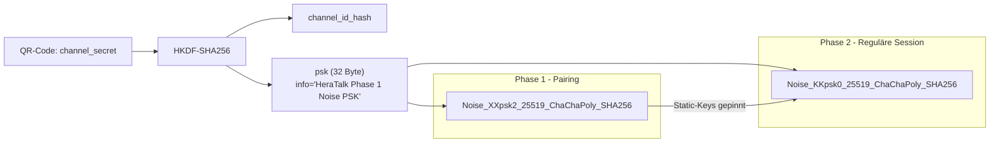

# ADR-0002: Noise Protocol Framework für Authentifizierung und Schlüsselaustausch

## Status: Accepted

## Datum

2026-04-30

## Kontext

HeraTalk arbeitet brokerlos und ohne Public-Key-Infrastruktur. Es gibt keinen Anker, gegen den ein Zertifikat geprüft werden könnte, und es gibt keine zentrale Identitätsstelle, die "dieser Schlüssel gehört zu Alice" bestätigt. Trotzdem müssen sich zwei Geräte gegenseitig authentifizieren, einen gemeinsamen Sitzungsschlüssel aushandeln und gegen aktive Man-in-the-Middle-Angriffe geschützt sein.

Im HeraTalk-Modell entsteht das gemeinsame Geheimnis — das **Channel-Secret** — erst durch den **out-of-band-Austausch via QR-Code** (`docs/architecture.md §9`). Aus diesem Channel-Secret leitet sich anschließend:

- die Channel-ID (zum Filtern nicht passender Peers),
- der PSK für laufende Sessions,
- und die Bindung beider Peers an dieselbe Gruppe.

**Vor dem QR-Austausch** existiert dieses Geheimnis nicht — der Initial-Handshake (Phase 1) muss daher einen Modus verwenden, der gleichzeitig den frisch übermittelten PSK kryptographisch in den Handshake-State einmischt und die Static-Public-Keys beider Seiten erst während des Handshakes austauscht. **Nach dem QR-Austausch** ist das Channel-Secret auf beiden Geräten verfügbar; ab diesem Zeitpunkt darf Phase 2 (regulärer Session-Handshake) genutzt werden, bei dem zusätzlich die Static-Public-Keys gepinnt sind.

Aus dieser Situation entsteht ein scheinbarer Widerspruch in der bisherigen Doku-Lage:

- Bisheriges ADR-0002 nannte `Noise_XX_25519_AESGCM_SHA256` (reines XX-Pattern, ohne PSK-Bindung).
- `docs/architecture.md §9` nennt `Noise_KKpsk0_25519_ChaChaPoly_SHA256` (KK-Pattern mit PSK).

Beide Aussagen sind richtig, aber für **unterschiedliche Phasen** — und das reine XX-Pattern bindet einen PSK nicht kryptographisch an den Handshake-State, sodass Phase 1 das `XXpsk2`-Variantenpattern verwenden muss. Dieses ADR löst den Widerspruch auf und legt fest, welcher Handshake wann genutzt wird.

## Entscheidung

HeraTalk verwendet das **Noise Protocol Framework** mit zwei klar abgegrenzten Mustern:

### Phase 1 — Initiales Pairing: `Noise_XXpsk2_25519_ChaChaPoly_SHA256`

- Wird genau dann verwendet, wenn zwei Geräte sich zum ersten Mal verbinden und das Channel-Secret bisher nur über den **out-of-band**-Kanal (QR-Code) ausgetauscht wurde.
- Das `XX`-Basispattern ist nötig, weil hier kein dauerhaftes Pinning der Static-Public-Keys vorliegt — die Public-Keys werden im Handshake selbst übermittelt.
- **Wichtig:** Das reine `XX`-Pattern integriert einen PSK **nicht** kryptographisch in den Handshake-State; eine externe Bindung des Channel-Secrets würde den MITM-Schutz durch den QR-Code nicht wirklich greifen lassen. HeraTalk verwendet daher die Variante **`XXpsk2`**: der PSK wird **nach** der zweiten Handshake-Nachricht in den Handshake-State eingemischt — also nachdem beide Ephemeral-Keys ausgetauscht wurden, aber bevor die Static-Keys final bestätigt sind.
- Authentizität wird durch den **Code-Match** im QR-Code-Flow hergestellt: das Channel-Secret aus dem QR-Code wird über HKDF-SHA256 zum Noise-PSK abgeleitet. PSK-Ableitungs-Parameter:
  - `IKM` (Input Keying Material): `channel_secret` (32 Byte aus QR-Code)
  - `salt`: `""` (leer)
  - `info`: `"HeraTalk Phase 1 Noise PSK"` (UTF-8)
  - `L` (Output-Länge): 32 Byte

  Das Ergebnis wird unverändert als Noise-PSK in den `XXpsk2`-Handshake eingespeist.
- Direkt nach dem ersten erfolgreichen `XXpsk2`-Handshake werden die übermittelten Static-Public-Keys gepinnt und persistiert — ab da gilt für diesen Peer Phase 2.

<!-- TODO(architect): align with ADR-0002 XXpsk2 — `architecture.md §9` referenziert noch `Noise_KKpsk0_25519_ChaChaPoly_SHA256` für Phase 2 (korrekt), nennt aber Phase 1 nicht explizit. Bei nächster Architektur-Doku-Runde Phase-1-Pattern explizit auf `XXpsk2` setzen. -->

### Phase 2 — Reguläre Channel-Session: `Noise_KKpsk0_25519_ChaChaPoly_SHA256`

- Wird ab der zweiten Verbindung zu einem bekannten Peer verwendet, also im Normalbetrieb.
- `KK` setzt voraus, dass beide Seiten den Static-Public-Key des Gegenübers bereits kennen — genau das ist nach dem Pairing der Fall.
- `psk0` bindet zusätzlich den Channel-Secret als Pre-Shared-Key in die erste Handshake-Nachricht. Damit kann ein Angreifer, der einen einzelnen Static-Key gestohlen hat, ohne zusätzlich das Channel-Secret zu kennen, **nicht** in den Kanal eindringen.
- Cipher-Suite: ChaCha20-Poly1305 für die Datenströme (AEAD, Konstantzeit auf allen relevanten ARM-Plattformen). SHA-256 als Hash, X25519 als DH.

### Cipher-Suite-Begründung

ChaCha20-Poly1305 statt AES-GCM, weil:

- Konstantzeit-Software-Implementierung auf allen ARM-CPUs ohne AES-NI / ARMv8-Crypto-Extensions, also auf praktisch jedem Android-Gerät unterhalb der Mittelklasse stabil.
- Keine Nonce-Reuse-Katastrophe wie bei AES-GCM bei niedrigem Counter-State.
- Wird auch von SRTP-Profil `AEAD_AES_128_GCM`-Alternativen bewusst gewählt; harmoniert mit der SRTP-Schicht in `:service:media`.

### Implementierungs-Heimat

Beide Handshake-Pfade werden in `:core:crypto` implementiert. Empfohlene Bibliothek: `noise-java` (rweather), vendored mit Hash-Pin. Falls die Lizenz oder Maintenance-Lage später kippt, ist eine eigene Implementierung machbar — der Standard-Text ist explizit gestaltet, und ein Property-Test gegen Test-Vektoren (`docs/architecture.md §13`, Kotest) deckt die Kernlogik ab.

## Konsequenzen

**Positiv:**

- Klare Trennung zwischen "wir kennen uns noch nicht" und "wir kennen uns" — beide haben angemessene Sicherheits-Eigenschaften.
- Forward Secrecy in beiden Phasen (jedes Handshake erzeugt frische ephemere Keys).
- **MITM-Schutz im initialen Pairing greift kryptographisch:** durch die `psk2`-Variante ist das aus dem QR-Code abgeleitete Channel-Secret in den Handshake-State eingemischt — ein Angreifer ohne QR-Code kann den Handshake nicht aushandeln.
- Kompromittierung eines Static-Private-Keys allein reicht in Phase 2 nicht aus — der Angreifer braucht zusätzlich das Channel-Secret.
- Keine PKI, keine Zertifikate, keine externen Trust-Anchors — passt zum brokerlosen Modell.
- Property-basierte Tests gegen offizielle Noise-Test-Vektoren möglich.

**Negativ / Risiken:**

- Zwei Handshake-Pfade kosten Implementierungs- und Test-Aufwand. Mitigation: gemeinsame Cipher-Suite, gemeinsame Bibliothek, einheitliche Outer-Frame-Struktur.
- Verlust des QR-Codes / Channel-Secrets bedeutet: Re-Pairing aller Geräte. Das ist eine bewusste Eigenschaft, nicht ein Bug — es gibt keinen "Reset" über die Cloud, weil es keine Cloud gibt.
- Static-Key-Pinning erfordert sicheren Speicher: `:core:identity` hält die gepinnten Keys, verschlüsselt via Android Keystore. Verlust dieser Daten erzwingt Re-Pairing.
- Keine Interop mit anderen Walkie-Talkie-Apps oder SIP/WebRTC-Clients — explizit gewünscht.

**Auswirkungen auf den Code:**

- `:core:crypto` exportiert eine `HandshakeEngine`-API mit zwei Modi (`Pairing`, `Session`); der Aufrufer entscheidet anhand des Pinning-Status, welcher Modus gilt.
- `:service:signaling` triggert die Handshake-Auswahl basierend auf `IdentityRepository.isPinned(peerStaticKey)`.
- CODEOWNER-Pflicht-Review für jede Änderung in `:core:crypto`.

## Abgewogene Alternativen

### A. TLS 1.3 mit Pre-Shared-Key-Suite

TLS-PSK statt Noise.

- Pro: weit verbreitet, breit auditiert, viele Stack-Optionen.
- Contra: TLS ist auf das **Client-Server**-Modell zugeschnitten — Peer-zu-Peer ohne Server bedeutet, dass jeder Peer abwechselnd Client und Server sein muss, mit doppelter Konfiguration. PSK-Suiten sind in vielen Stacks zweitklassig gepflegt. PKI-Tooling und Zertifikate sind auf eine Art unsere Realität, die wir gerade nicht brauchen — und die zugleich Türen öffnet (Trust-Stores, Hostname-Validierung, ALPN), die wir hier nicht wollen.
- TLS-1.3-Handshake hat ein größeres Wire-Format und mehr Roundtrips als Noise-KK.

Verworfen.

### B. DTLS

DTLS für UDP-Datenebene direkt.

- Pro: standardisiert, in WebRTC-Stacks bekannt.
- Contra: erbt alle TLS-Eigenheiten, ist dabei für UDP-Verlust-Toleranz nochmal komplexer. DTLS in BouncyCastle ist sperrig zu konfigurieren. SRTP-Keys müsste man trotzdem aus DTLS-Material ableiten — gleicher Aufwand wie mit Noise + HKDF.

Verworfen.

### C. Eigenes EC-DH-Schema mit ChaCha20-Poly1305

Selbst gebauter Handshake "X25519 + HKDF + AEAD".

- Pro: minimaler Wire-Footprint, volle Kontrolle.
- Contra: kein formales Sicherheits-Modell, kein Code-Review durch eine externe Crypto-Community, keine Test-Vektoren. Genau die Klasse von Selbstbauten, die in der Vergangenheit reihenweise gebrochen worden ist (Telegram MTProto v1, früher iMessage etc.).
- Widerspricht `.claude/rules.md` "keine eigenen Crypto-Konstruktionen ohne formales Modell".

Verworfen — explizit gegen die Crypto-Hygiene-Regel.

### D. Signal-Protokoll (X3DH + Double Ratchet)

Kompletter Signal-Stack.

- Pro: state-of-the-art, formal analysiert, hervorragende Forward-Secrecy- und Post-Compromise-Eigenschaften.
- Contra: Out-of-Order-Resilienz und Pre-Key-Bundles setzen ein Server-mediated-Modell voraus; Group-Messaging mit mehreren Peers im Mesh erzwingt zusätzliche Komplexität (Sender-Keys / Pairwise-Channels), die wir bewusst nicht ziehen. Zu viel Maschinerie für unseren Walkie-Talkie-Use-Case mit Channel-Secret.
- Group-Rekey bei Kanal-Secret-Kompromittierung ist als TBD in `docs/project-state.md` notiert (MLS-Pfad), wird aber nicht in v1.0 entschieden.

Verworfen — Komplexität nicht gerechtfertigt für v1.0.

## Referenzen

- [Noise Protocol Framework — Specification (Revision 34)](https://noiseprotocol.org/noise.html)
- `docs/architecture.md §9` — Security-Design
- `docs/requirements.md` NF-04 — Vertraulichkeit / Authentizität
- `.claude/rules.md` — Crypto-Hygiene
- `docs/project-state.md` — Entscheidungsprotokoll 2026-04-24 (Noise-Wahl), TBD MLS-Group-Rekey
