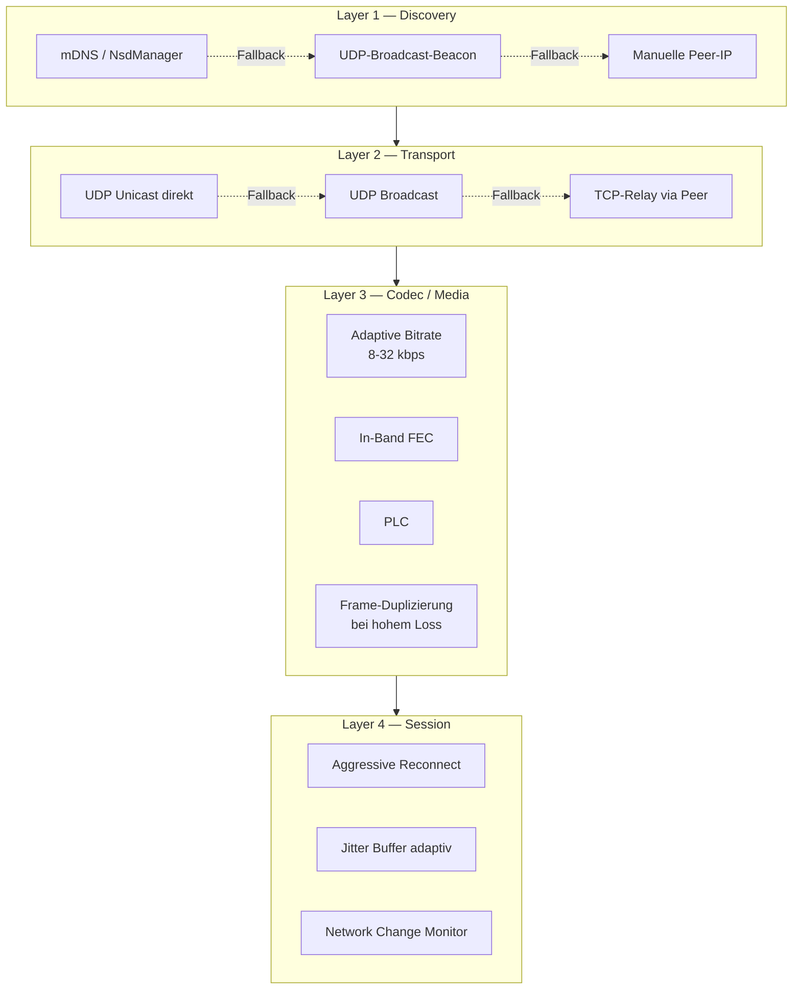
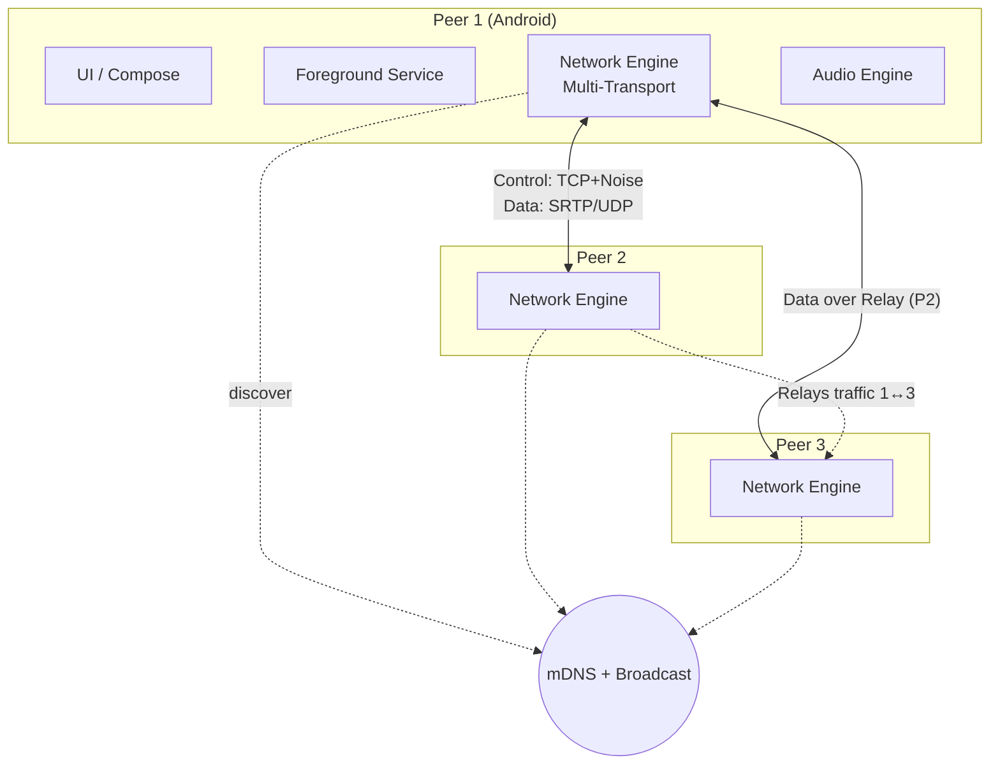
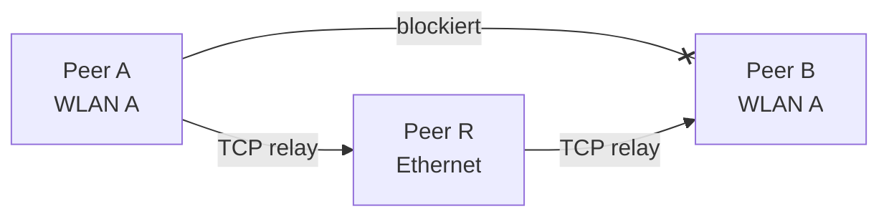
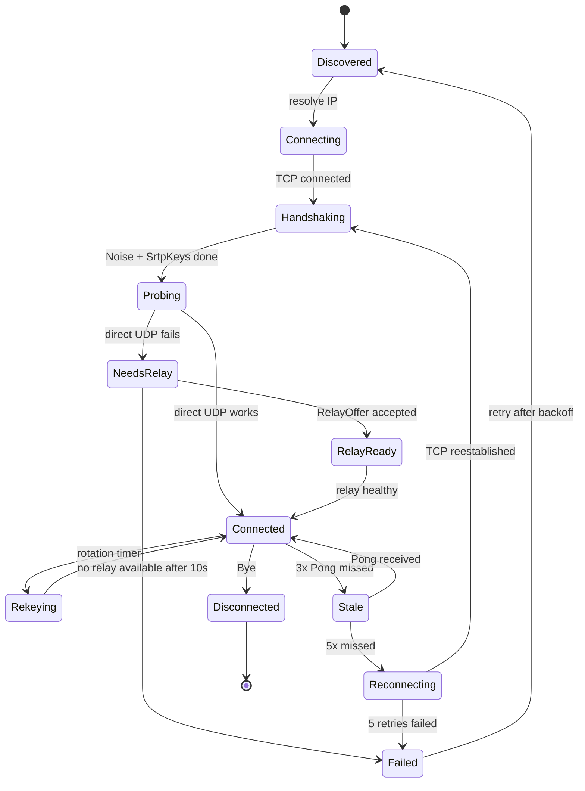
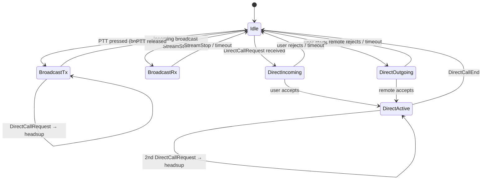
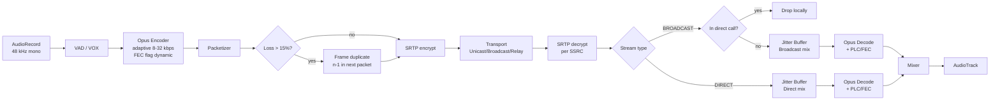

# HeraTalk — Architektur

> Android-Walkie-Talkie für LAN/WLAN. Peer-to-Peer Mesh, keine Server, keine Accounts.

**Projekt:** HeraTalk
**Publisher:** relexx (relexx.de)
**Repository:** https://github.com/relexx/heratalk
**Lizenz:** BSD 3-Clause (wie Opus)
**Package:** `de.relexx.heratalk`

---

## 1. Entscheidungsgrundlage

| Aspekt | Entscheidung |
|--------|--------------|
| Zielplattform | min SDK Android 10 (API 29), target SDK Android 16 (API 36) — Pflicht für Google Play ab August 2026 |
| Framework | Natives Kotlin + Jetpack Compose |
| Architektur | Peer-to-Peer Mesh, brokerlos |
| Primäre Netzwerk-Topologie | Single WLAN, Single Subnet |
| Robustheits-Anspruch | Funktioniert unter schlechten AP-Bedingungen: Client-Isolation, Multicast-Drops, Throttling, Flapping |
| Discovery | mDNS/DNS-SD via `NsdManager`, UDP-Broadcast-Fallback, manuelle Peer-Eingabe |
| Control-Transport | TCP (primär), UDP-Fallback nur für Ping/Discovery |
| Daten-Transport | UDP Unicast (primär), UDP Broadcast (optional), TCP-Relay via Peer (Fallback) |
| Codec | Opus, adaptiv 8–32 kbps, 20 ms Frame-Default, DTX, PLC, In-Band-FEC |
| Kommunikationsmodelle | Broadcast (Kanal-weit) **und** 1:1-Direktgespräche |
| PTT-Modus | Halbduplex PTT **und** VOX, umschaltbar — gilt für beide Modelle |
| Verschlüsselung | SRTP (ChaCha20-Poly1305) mit Noise-KKpsk0-Keyexchange |
| Kanäle | Nutzer wählt Kanal beim Start |

## 2. Robustheits-Design (Querschnitt)

Die Robustheit wird **nicht** als eine einzige Schutzmaßnahme gelöst, sondern durch eine Kaskade unabhängiger Mechanismen auf allen Schichten. Ziel: Wenn eine Schicht kaputt ist, übernimmt die nächste, ohne dass der Nutzer es bemerkt.



Mitigations gegen typische AP-Pathologien:

| AP-Pathologie | Mitigation |
|----------------|-----------|
| Multicast-Drops / mDNS blockiert | UDP-Broadcast-Beacon auf eigenem Port |
| Client-to-Client-Isolation | TCP-Relay über dritten Peer (Content bleibt E2E-verschlüsselt) |
| Bandbreiten-Throttling | Adaptive Opus-Bitrate, DTX, Frame-Größen-Anpassung |
| Hoher Paketverlust | Opus In-Band-FEC + App-Level-Frame-Duplizierung |
| Flapping (AP-Restart, Roaming) | Aggressive TCP-Reconnect, UDP-Rebind, Jitter-Buffer bleibt bestehen |
| Client-Sleep / Power-Save | `MulticastLock` + Foreground-Service |
| IP-Wechsel | `ConnectivityManager.NetworkCallback` triggert Rebind + Peer-Notify |
| Discovery-Zeitfenster zu kurz | Continuous discovery, History-based Reconnect zu letzten bekannten IPs |

## 3. System-Übersicht



## 4. Modul-Struktur (Gradle)

```
:app                                # Einstieg, Navigation, DI-Graph
:core:model                         # Domain-Modelle
:core:ui                            # Theme, wiederverwendbare Composables
:core:crypto                        # Noise, HKDF, ChaCha20-Poly1305, SRTP-Keys
:core:logging                       # Strukturiertes Logging, Dev-Overlay
:core:identity                      # IdentityRepository: display_name (DataStore), Validierung, Sanitisierung, Fallback
:service:discovery                  # NSD + Broadcast-Beacon + manuelle Eingabe
:service:transport                  # Multi-Transport Engine (UDP, Broadcast, Relay)
:service:signaling                  # Control-Plane (TCP + Noise-Handshake)
:service:media                      # SRTP-Send/Recv, Jitter-Buffer, Mixer
:service:audio                      # AudioRecord/AudioTrack + Opus (JNI)
:service:ptt                        # PTT-Orchestrator, Floor-Control, VOX
:service:relay                      # Relay-Funktionalität
:service:lifecycle                  # Foreground-Service mit dynamischem Typ-Wechsel (siehe §11.3)
:feature:pairing                    # QR-Scan + Kanal-Setup
:feature:channel                    # Hauptbildschirm, Peer-Liste, PTT-Button
:feature:direct                     # 1:1-Direktgespräche
:feature:settings                   # Audio, VOX, Diagnose
```

Abhängigkeitsregel: Abhängigkeiten fließen nur nach innen — `feature` → `service` → `core`. Niemals umgekehrt. Insbesondere greifen `:feature:pairing`, `:feature:settings` und `:service:discovery` ausschließlich über `:core:identity` auf den Display-Namen zu — keines dieser Module liest oder schreibt den DataStore-Key direkt.

### 4.1 Adapter-Schichten in `:core:*`-Modulen

`.claude/rules.md` Rule 17 verbietet Android-SDK-Imports in `:core:*`-Modulen. Zwei Module benötigen jedoch eine Plattform-Bindung, weil sie eine Default-Implementierung für ihre Domain-API mitliefern: `:core:logging` (logcat-Adapter) und `:core:identity` (DataStore-Persistenz für den Display-Namen, Android-Keystore für gepinnte Static-Keys). Beide Module sind als `com.android.library` konfiguriert.

Diese Ausnahme ist in **ADR-0004** (`docs/adrs/0004-core-android-adapters.md`) formal geregelt. Kurzfassung der Akzeptanz­kriterien:

- Reines Domain-Interface in eigener Datei ohne Android-Imports (z. B. `Logger.kt`, `IdentityRepository.kt`).
- Adapter-Klassen sind explizit mit Suffix `Adapter` oder `Impl` benannt (z. B. `AndroidLogcatLogger`, `DataStoreIdentityRepository`) — nur diese Dateien dürfen `android.*`/`androidx.*` importieren.
- Adapter sind, soweit möglich, `internal`; nur das Interface und die DI-Factory sind `public`.
- Domain-Tests laufen als reine JUnit-5-Tests ohne Robolectric gegen das Interface.
- Android-Symbole erscheinen nicht in der Interface-Signatur (kein `Context`, kein `Bundle`, kein `View`).

**Whitelist der `:core:*`-Module mit Adapter-Schicht** (Stand v0.1.0):

| Modul | Adapter-Klasse | Plattform-Abhängigkeit |
| --- | --- | --- |
| `:core:logging` | `AndroidLogcatLogger` | `android.util.Log` |
| `:core:identity` | `DataStoreIdentityRepository`, später Keystore-Adapter | `androidx.datastore.preferences`, `android.security.keystore` |

Alle anderen `:core:*`-Module (`:core:crypto`, `:core:model`) sind strikt JVM-only. `:core:ui` ist eine Compose-Android-Library (`com.android.library` + Compose) und darf Compose- und Android-APIs nutzen, exportiert jedoch keine Android-Typen in seiner öffentlichen API (keine `Context`-, `View`- oder `Bundle`-Parameter an den Composables). Erweiterungen der Whitelist sind Architektur-Änderungen und brauchen ein neues ADR oder ein Update von ADR-0004.

## 5. Kommunikationsmodelle

### 5.1 Broadcast

Standardbetrieb. Jeder Peer im Kanal sendet Audio an alle anderen Peers im Kanal. Half-Duplex (PTT) mit Floor-Control oder Full-Duplex (VOX).

### 5.2 1:1-Direktgespräch

Zwei Peers im selben Kanal können zusätzlich ein privates Gespräch führen:

- **Isolation:** Nur die beiden Teilnehmer hören den Stream. Andere Peers sehen im Roster den Status "in direct call", hören aber nichts.
- **Broadcast-Muting:** Während des Direktrufs wird lokaler Broadcast-Empfang stumm, bleibt aber aktiv (Seq-State erhalten).
- **Floor-Control separat:** Unabhängig vom Broadcast-Floor.
- **Ringsignal:** Peer A initiiert → B bekommt UI-Signal + Ton → annimmt oder ablehnt.

### 5.3 Stream-Typen und Addressing

Zwei Stream-Typen pro Peer-Paar, getrennte SSRCs:

```
SSRC-Struktur (32 bit):
  bit 31..28: stream type
    0x0 = BROADCAST
    0x1 = DIRECT
    0x2 = RELAY (Outer)
  bit 27..0:  sender peer short ID
```

## 6. Protokoll-Design

### 6.1 Discovery (mehrstufig)

**Stufe 1 — mDNS/NSD (primär):**
- Service-Typ: `_heratalk._tcp.local.`
- TXT-Records: `ver`, `chan` (SHA-256 des Kanal-Passworts, gekürzt), `pk` (X25519 Static Public Key), `dname` (Display-Name)
  - `dname`: 1–32 Unicode-Codepoints. Eingabe in `:feature:pairing` (Pflichtfeld, leerer Default, Placeholder-Text), Owner: `:core:identity` (`IdentityRepository` mit DataStore-Key `display_name`). Änderbar in `:feature:settings`. Pflichtfeld; Fallback bei Korruption oder Migration: `Peer-{first8hex(pk)}` (z. B. `Peer-a7f32c91`) — niemals `Build.MODEL`, niemals Geräte-Hostname (Datenschutz).

**Stufe 2 — UDP-Broadcast-Beacon (Fallback):**

Falls kein Peer über mDNS gefunden (5 s Timeout) oder erzwungen: UDP-Broadcast auf 255.255.255.255:45678 mit binärem Paket:

```
Magic (4) | Version (1) | Peer Short-ID (4) | Static PK (32)
| Channel-ID-Hash (8) | TCP-Port (2) | Display-Name-Len (1) | Display-Name
```

- `Display-Name`: UTF-8-encoded, App-seitig auf 32 Codepoints begrenzt (max. ~128 Byte UTF-8). Bei Serialisierung wird auf Codepoint-Grenze unterhalb 255 Byte abgeschnitten, sodass das Längenfeld nicht überläuft. Immer gesetzt; bei Korruptions-Fallback `Peer-{first8hex(pk)}` (siehe oben).

Alle 3 s ein Beacon. Parallel horchend.

**Reactive Re-Registrierung:**

`:service:discovery` subscribt auf `IdentityRepository.displayName` als `Flow<String>`. Bei Emission eines neuen Werts wird mDNS neu registriert (Debounce 300 ms gegen Eingabe-Bursts). Der Broadcast-Beacon liest den Wert pro Tick (alle 3 s) — kein expliziter Trigger erforderlich.

**Empfangs-Sanitisierung für `dname`:**

Eingehende `dname`-Werte fremder Peers werden vor jeglicher UI-Darstellung in `:service:discovery` sanitisiert. Sicherheits- und Privacy-Hintergrund siehe `docs/security-audit.md` F-PRIV-04. Pipeline:

1. **NFC-Normalisierung** (Unicode Normalization Form Canonical Composition) — verhindert visuelle Lookalikes durch alternative Codepoint-Kombinationen.
2. **Strip Bidi-Override-Codepoints:** entferne `U+202A`–`U+202E` und `U+2066`–`U+2069` (RTL-/LRO-/PDI-Override) — verhindert UI-Spoofing durch Rechts-nach-Links-Override.
3. **Combining-Marks-Begrenzung:** maximal 2 Combining Marks pro Base-Codepoint — verhindert "Zalgo"-Angriffe und übergroße Textdarstellung.
4. **Truncation auf 32 Codepoints** (NICHT Bytes oder UTF-16 Code Units).
5. **Wenn nach Sanitisierung leer** (z. B. nur Bidi-Codepoints im Original): Ersatz durch `Peer-{first8hex(pk)}`.

Sanitisierte Werte werden im `Peer`-Modell gehalten; das Original wird verworfen.

**Stufe 3 — Manuelle Peer-Eingabe:**

UI-Fallback: Nutzer gibt IP direkt ein.

### 6.2 Control-Plane Messages

Basis: `Hello`, `SrtpKeys`, `SrtpRekey`, `FloorRequest`, `FloorGrant`, `FloorBusy`, `FloorRelease`, `StreamStart`, `StreamStop`, `Ping`, `Pong`, `Bye`.

**Neu für Direktgespräche:**

| Message | Richtung | Zweck |
|---------|----------|-------|
| `DirectCallRequest` | A → B | Direktruf initiieren |
| `DirectCallAccept` | B → A | Annehmen |
| `DirectCallReject` | B → A | Ablehnen (Grund: BUSY / DENIED / OFFLINE) |
| `DirectCallEnd` | beidseitig | Beenden |
| `DirectCallStatus` | beidseitig → alle | Announce "in Direktruf" für Roster |

**Neu für Transport-Adaption:**

| Message | Richtung | Zweck |
|---------|----------|-------|
| `TransportProbe` | beidseitig | UDP-Reachability testen |
| `TransportReport` | beidseitig | Auswertung: UDP-Latenz, Loss |
| `RelayOffer` | A → B | "Ich kann als Relay dienen" |
| `RelayRequest` | A → B | "Bitte relay zu C für mich" |
| `RelayAvailable` | C → A | "Bin bereit, A↔B zu relayen" |

**Neu für Codec-Adaption:**

| Message | Richtung | Zweck |
|---------|----------|-------|
| `CodecHint` | Empfänger → Sender | Loss-Feedback für Bitrate-Anpassung |

## 7. Transport-Kaskade

### 7.1 Priorisierung

Sendepfad pro Empfänger, absteigend:

1. **UDP Unicast direkt** (Standard, minimaler Overhead).
2. **UDP Broadcast** (nur Broadcast-Streams, wenn AP nicht raten-limitiert).
3. **UDP-Relay** über dritten Peer.
4. **TCP-Relay** über dritten Peer (wenn UDP generell fehlschlägt).

### 7.2 Probing

Nach Control-Aufbau: `TransportProbe` über UDP direkt. Bei 2 s ohne Antwort → Broadcast, dann Relay-Angebote.

### 7.3 Broadcast-Sendung

Wenn > 2 Empfänger, Broadcast-Stream-Typ und AP tauglich:
- Sender schickt **einmal** per UDP-Broadcast.
- Empfänger filtern per `channel_id_hash` + SSRC.
- RTCP-Reports implizit.

Fallback: Unicast-N-Copies.

### 7.4 Keepalive und Reconnect

- Control-TCP: `Ping`/`Pong` alle 5 s. 3× verpasst → "Stale". 5× → Reconnect (Backoff 1/2/5/10/30/60 s).
- Datenpfad-UDP: Kein explizites Keepalive, Signal ist fehlender RTP + Control-State.
- Netzwerk-Wechsel (`NetworkCallback.onAvailable`/`onLost`): Rebind aller Sockets, Neudiscovery, Noise-Rehandshake mit bekannten Peers.

### 7.5 Relay-Mode (gegen AP-Client-Isolation)

AP-Client-Isolation blockiert Client-zu-Client-Kommunikation. Mitigation: dritter Peer leitet Traffic weiter.



Relay-Peer R darf den Audio-Inhalt **nicht** lesen — SRTP bleibt E2E. R sieht nur Outer-Frame:

```
Outer Relay Frame:
  | Magic | SrcPeerId | DstPeerId | InnerType (0x1=SRTP) | InnerLen | InnerPayload |
```

`InnerPayload` ist der unveränderte SRTP-Frame. Datenschutzfreundlich by design.

Relay-Wahl: A sendet `RelayOffer` als Broadcast im Kanal nach 5 s ohne direkten Probe. Peers mit Konnektivität zu beiden antworten `RelayAvailable`. A wählt nach niedrigster Latenz.

### 7.6 Connectivity Prober

Beim Start und bei Netzwerkwechsel:

1. WLAN verbunden? SSID? IPv4? Subnetz?
2. mDNS funktioniert (Router antwortet auf Multicast-DNS)?
3. Broadcast-Loopback (eigener Broadcast kommt zurück)?
4. Peers? Wie viele?
5. UDP-Probe zu jedem Peer erfolgreich?

Ergebnis → "Netzwerk-Qualität"-Indikator in UI (grün/gelb/rot).

## 8. State Machines

### 8.1 Peer Session



### 8.2 Lokaler Audio-Zustand



Hinweis: Während `DirectActive` wird Broadcast-Playback lokal gemutet, Empfang läuft weiter (Roster + Seq-State).

**Busy-Verhalten bei eingehendem Direktruf (F-12):** In den Zuständen `BroadcastTx` und `DirectActive` löst ein eingehender `DirectCallRequest` **keinen** Voll-Screen-Wechsel aus. Stattdessen:

1. `:feature:direct` rendert eine Heads-up-Einblendung mit Caller-Name und Aktionen "Später / Ablehnen".
2. Benachrichtigungs-Pattern (stumm / Vibration / Klingelton) ist aus `DataStore` konfigurierbar.
3. Bei "Später" wird der `DirectCallRequest` in einer `pendingCalls`-Queue gehalten. Sobald `BroadcastTx` in `Idle` transitioniert oder `DirectActive` via `DirectCallEnd` endet, öffnet sich der Standard-Annehmen-Screen — vorausgesetzt der Anrufer hat nicht inzwischen `DirectCallEnd` geschickt.
4. Bei "Ablehnen" wird `DirectCallReject(reason=BUSY)` an den Anrufer gesendet.
5. Legt der Anrufer von selbst auf (`DirectCallEnd` vom Anrufer), wird die Heads-up-Einblendung durch "Verpasster Ruf"-Info ersetzt, die nach 5 s ausblendet.

## 9. Security-Design

Basis:
- Noise **KKpsk0_25519_ChaChaPoly_SHA256** für Handshake (Static-Key-Pinning + PSK aus Channel-Secret)
- SRTP mit AEAD (ChaCha20-Poly1305 oder AES-GCM)
- Replay-Window 64 Pakete
- Rekey vor 2³¹ Paketen

**Stream-Type im HKDF-Info:**

```
channel_secret (32 byte, QR-Code)
├─► channel_id_hash (→ mDNS TXT "chan")
└─► psk (→ Noise KKpsk0)

Noise-Handshake(A,B) → shared_secret_AB
├─► srtp_key_A→B_broadcast   = HKDF(shared, "srtp/broadcast/send")
├─► srtp_key_A→B_direct      = HKDF(shared, "srtp/direct/send")
├─► srtp_key_B→A_broadcast   = HKDF(shared, "srtp/broadcast/recv")
└─► srtp_key_B→A_direct      = HKDF(shared, "srtp/direct/recv")
```

Broadcast- und Direct-Keys sind per Design unterschiedlich. Cross-Context-Replays scheitern.

**Relay-Outer-Frame:** bewusst unverschlüsselt und unauthentifiziert. R kann nur droppen, nicht modifizieren (SRTP-Tag würde fehlschlagen). Outer-Frame trägt **TTL=1**, damit kein Multi-Hop-Relay-Loop entstehen kann.

**Verbindliche Validierungs-Reihenfolge bei eingehenden Paketen** (siehe `.claude/rules.md` Regel 11):

1. Hard size limit (max 1500 Byte UDP, max 64 KB TCP-Frame).
2. Magic-Bytes + Version-Field-Check.
3. Channel-ID-Hash-Filter — nicht-passende Pakete sofort verwerfen, kein weiteres Logging, keine weitere Verarbeitung.
4. Replay-Window-Check (vor Crypto, weil günstiger).
5. AEAD-Decrypt + Tag-Verify (Konstantzeit-Vergleich, siehe `.claude/rules.md` Regel 12).
6. Erst danach Inhalts-Parsing der Decrypted Payload.

Verstöße gegen diese Reihenfolge sind Sicherheitslücken — z. B. wer in Schritt 3 schon den vollen Frame parst, öffnet einen Pre-Auth-Parser-DoS. Wer in Schritt 5 nicht-konstantzeit vergleicht, leakt das Tag.

## 10. Audio-Pipeline mit Adaptivität



### 10.1 Adaptive Codec-Parameter

Feedback via periodischem `CodecHint`:

| Loss-Rate | Bitrate | FEC | App-Duplikat |
|-----------|---------|-----|--------------|
| 0–2 % | 24 kbps | off | off |
| 2–5 % | 20 kbps | on | off |
| 5–15 % | 16 kbps | on | off |
| 15–30 % | 12 kbps | on | on (n-1 in n) |
| > 30 % | 8 kbps narrowband | on | on |

**Wichtig: CBR-only.** Der Opus-Encoder läuft strikt im Constant-Bitrate-Modus, nicht VBR. Begründung: VBR korreliert Paketgröße mit phonetischem Inhalt — bekannter Side-Channel-Angriff (Wright et al. 2008 für Skype). CBR kostet leicht Audio-Qualität, schließt aber den Inhalts-Leak. Padding auf nächste 8-Byte-Grenze für gleichmäßige Pakete.

Decoder-Rekonstruktion (Reihenfolge):
1. Opus In-Band FEC
2. App-Frame-Duplikat aus nachfolgendem Paket
3. Opus PLC

### 10.2 Adaptive Jitter Buffer

- **Target-Delay:** 40 ms bei niedrigem Loss, bis 200 ms bei Burst-Loss.
- **High-Watermark-Trigger:** älteste Frames verwerfen.
- **Speed-Up bei Überfüllung:** WSOLA oder Frame-Skipping bis 5 %.

### 10.3 Device-Level-Robustheit

- `MediaRecorder.AudioSource.VOICE_COMMUNICATION` (Hardware-AEC/NS).
- `acousticEchoCanceler` / `noiseSuppressor` / `automaticGainControl` wenn `isAvailable()`.
- Bluetooth-Headset: `AudioManager.startBluetoothSco()` + Routing-Handling.

## 11. Android-Integration

### 11.1 Manifest-Permissions

**Manifest (`AndroidManifest.xml`):**

```xml
<!-- Immer aktiv, keine Runtime-Permission -->
<uses-permission android:name="android.permission.INTERNET" />
<uses-permission android:name="android.permission.ACCESS_NETWORK_STATE" />
<uses-permission android:name="android.permission.ACCESS_WIFI_STATE" />
<uses-permission android:name="android.permission.CHANGE_WIFI_MULTICAST_STATE" />
<uses-permission android:name="android.permission.FOREGROUND_SERVICE" />
<uses-permission android:name="android.permission.MODIFY_AUDIO_SETTINGS" />

<!-- Runtime, beim ersten Sende-Versuch (PTT-Tap, VOX, Hardware-PTT) abgefragt -->
<uses-permission android:name="android.permission.RECORD_AUDIO" />

<!-- Runtime, nur bei Notification-Service-Start (Android 13+) -->
<uses-permission android:name="android.permission.POST_NOTIFICATIONS" />

<!-- Runtime, nur beim ersten QR-Scan -->
<uses-permission android:name="android.permission.CAMERA" />

<!-- Runtime, nur wenn Nutzer Bluetooth-Headset-Integration aktiviert -->
<uses-permission android:name="android.permission.BLUETOOTH_CONNECT"
    android:minSdkVersion="31" />

<!-- Foreground-Service-Typen: deklariert, aber nur aktiv wenn
     das zugehörige Feature aktiviert wurde -->
<uses-permission android:name="android.permission.FOREGROUND_SERVICE_CONNECTED_DEVICE" />
<uses-permission android:name="android.permission.FOREGROUND_SERVICE_MICROPHONE" />

<!-- Opt-in: Bildschirm bei eingehendem Direktruf einschalten (Android 14+ restriktiv) -->
<uses-permission android:name="android.permission.USE_FULL_SCREEN_INTENT" />
```

### 11.2 Feature-zu-Permission-Matrix

Das Permission-Modell ist **feature-gated**: Permissions werden nicht beim App-Start, sondern beim ersten Aktivieren des Features abgefragt. Ablehnung deaktiviert nur das Feature, nicht die App.

| Feature | Runtime-Permission | Foreground-Service-Typ | Trigger-Zeitpunkt |
|---------|-------------------|------------------------|-------------------|
| Kanal beitreten (nur hören) | keine | `connectedDevice` | Automatisch bei Kanal-Aktivierung |
| QR-Code scannen | `CAMERA` | — | Beim Tap auf "Kanal beitreten" |
| PTT senden (tap) | `RECORD_AUDIO` | `microphone` (nur während Aktivität) | Beim ersten PTT-Drücken |
| VOX-Modus | `RECORD_AUDIO` | `microphone` (dauerhaft) | Beim Toggle in Settings |
| Hardware-PTT · Bluetooth-Media-Button | `RECORD_AUDIO`, optional `BLUETOOTH_CONNECT` | `microphone` (dauerhaft) | Beim Aktivieren in Settings |
| Hardware-PTT · Lautstärke-Tasten | `RECORD_AUDIO` | `microphone` (dauerhaft) | Beim Aktivieren in Settings, mit Bestätigungs-Dialog zum System-Lautstärke-Konflikt |
| Hardware-PTT · konfig. KeyCode (post-v1.0) | `RECORD_AUDIO` | `microphone` (dauerhaft) | Beim Aktivieren in Settings |
| Benachrichtigung bei Direktruf | `POST_NOTIFICATIONS` | unverändert | Beim ersten Service-Start (Android 13+) |
| Wake-on-Direktruf | `USE_FULL_SCREEN_INTENT` | unverändert | Beim Toggle in Settings |

**Hardware-PTT-Implementation:**
- **Bluetooth-Media-Button:** `MediaSession` mit `setMediaButtonReceiver`. Empfängt `ACTION_MEDIA_PLAY_PAUSE` und mappt auf PTT-Down/Up via Long-Press-Erkennung.
- **Lautstärke-Tasten:** Im Vordergrund via `Activity.onKeyDown/onKeyUp` mit `event.keyCode == KEYCODE_VOLUME_UP` oder `VOLUME_DOWN`, Konsum durch `return true`. Im Hintergrund während aktivem `microphone`-Service über einen dedizierten `KeyEvent`-Interceptor — dies funktioniert nur, solange HeraTalk die System-Media-Session oder eine Accessibility-Variante als Receiver hält. Die Einschränkung wird dem Nutzer bei Aktivierung transparent gemacht.
- **Abfang-Scope:** Lautstärke-Tasten werden nur bei **aktivem Kanal und laufendem Service** abgefangen. Im Hintergrund ohne Kanal verhalten sich die Tasten normal.

### 11.3 Dynamischer Foreground-Service-Typ-Wechsel

Der Service in `:service:lifecycle` verwaltet den aktuellen Foreground-Typ und passt ihn der aktuellen Feature-Konfiguration an:

- **Nur Empfang (Default):** Typ `connectedDevice` — Audio hören, Netzwerk-Verbindungen halten, kein Mikrofon.
- **PTT aktiv (Activity sichtbar + Nutzer drückt):** Service bleibt auf `connectedDevice`, Mikrofon läuft nur als Activity-Resource (kein Service-Typ-Wechsel nötig, solange Activity im Vordergrund).
- **VOX oder Hardware-PTT aktiv:** Typ wechselt auf `microphone`. Notification-Text zeigt dem Nutzer transparent, dass das Mikrofon kontinuierlich aktiv ist.

Typ-Wechsel-Code (vereinfacht):

```kotlin
// service:lifecycle/HeraTalkService.kt
fun setFeatureState(newState: FeatureState) {
    val newType = when {
        newState.voxEnabled || newState.hardwarePttEnabled -> 
            ServiceInfo.FOREGROUND_SERVICE_TYPE_MICROPHONE
        newState.channelActive -> 
            ServiceInfo.FOREGROUND_SERVICE_TYPE_CONNECTED_DEVICE
        else -> null  // Service stoppen
    }
    if (newType == null) {
        stopSelf()
        return
    }
    if (newType != currentType) {
        // Transition: Notification neu erstellen, dann Typ wechseln
        val notification = buildNotification(newState)
        startForeground(NOTIFICATION_ID, notification, newType)
        currentType = newType
    }
}
```

Wichtig: Der Wechsel muss **atomar** sein — zwischen `stopForeground` und `startForeground` darf der Service nicht killbar werden. Das Muster oben nutzt nur `startForeground` mit neuem Typ, was Android als In-Place-Transition behandelt.

### 11.4 Permission-UX-Pattern

Für jedes permission-gebundene Feature gilt ein einheitlicher Ablauf im Code:

```kotlin
suspend fun enableFeature(feature: Feature): FeatureResult = when {
    !hasPermission(feature.requiredPermission) -> {
        val granted = requestPermission(feature.requiredPermission)
        if (granted) switchServiceTypeAndEnable(feature)
        else FeatureResult.PermissionDenied(feature)
    }
    else -> switchServiceTypeAndEnable(feature)
}
```

Bei `PermissionDenied` zeigt die UI einen nicht-ablenkenden Hinweis mit Link zu den System-App-Einstellungen, damit der Nutzer die Entscheidung bei Bedarf revidieren kann. Keine penetranten Re-Prompt-Loops.

### 11.5 Network-Monitor

```kotlin
// service:transport/NetworkMonitor.kt
class NetworkMonitor(context: Context) {
    private val cm = context.getSystemService<ConnectivityManager>()!!
    private val _events = MutableSharedFlow<NetworkEvent>(replay = 1)
    val events: SharedFlow<NetworkEvent> = _events

    private val callback = object : ConnectivityManager.NetworkCallback() {
        override fun onAvailable(network: Network) {
            _events.tryEmit(NetworkEvent.Available(network))
        }
        override fun onLost(network: Network) {
            _events.tryEmit(NetworkEvent.Lost(network))
        }
        override fun onLinkPropertiesChanged(network: Network, props: LinkProperties) {
            _events.tryEmit(NetworkEvent.LinkChanged(network, props))
        }
    }

    fun start() = cm.registerDefaultNetworkCallback(callback)
    fun stop() = cm.unregisterNetworkCallback(callback)
}
```

### 11.6 Foreground-Service-Regeln

- Service wird nur aus einer sichtbaren Activity heraus gestartet (Android-14+-Regel).
- Service-Restart-Policy: `START_NOT_STICKY` — bei Crash keine automatische Wiederaufnahme, Nutzer muss manuell neu starten (Konsistenz-Garantie für Feature-State).
- Notification-Text ist transparent und feature-abhängig: "HeraTalk aktiv im Kanal *Werkstatt Nord*" (Empfang) vs. "HeraTalk hört auf Stimme — VOX aktiv" (Mikrofon dauerhaft). Notification-Strings stammen aus `strings.xml` und sind lokalisiert (siehe §11.7).

### 11.7 Internationalisierung

HeraTalk ist von v0.1.0 an mehrsprachig aufgesetzt. MVP-Sprachen: Deutsch und Englisch. Default-Locale ist Englisch.

**Resource-Layout:**

```
core/ui/src/main/res/
├── values/strings.xml          # Englisch (Default)
└── values-de/strings.xml       # Deutsch (Override)

feature/channel/src/main/res/
├── values/strings.xml
└── values-de/strings.xml

feature/direct/src/main/res/
├── values/strings.xml
└── values-de/strings.xml

feature/pairing/src/main/res/
├── values/strings.xml
└── values-de/strings.xml

feature/settings/src/main/res/
├── values/strings.xml
└── values-de/strings.xml

app/src/main/res/
├── values/strings.xml          # App-Name, globale Texte (Notification-Channel-Name)
└── values-de/strings.xml
```

Strings sind nach Feature-Modul aufgeteilt — keine zentrale Mega-Datei. Wer das Channel-Feature antastet, findet die Strings unter `feature/channel/.../strings.xml` und nicht 600 km entfernt.

**Naming-Konvention für String-Keys:**

```xml
<!-- Hierarchisch: feature_screen_element_[variant] -->
<string name="channel_ptt_label_idle">Halten zum Sprechen</string>
<string name="channel_ptt_label_active">LIVE</string>
<string name="channel_ptt_label_busy_other">%1$s spricht</string>
<string name="channel_ptt_label_reconnecting">Netz prüfen</string>

<!-- Plurale -->
<plurals name="channel_peer_count">
    <item quantity="one">%d Peer</item>
    <item quantity="other">%d Peers</item>
</plurals>

<!-- Permission-Begründungen -->
<string name="permission_record_audio_rationale">
    HeraTalk benötigt Mikrofon-Zugriff, um deine Stimme zu senden.
    Die Aufnahme läuft nur, solange du die PTT-Taste drückst.
</string>
```

**Compose-Verwendung:**

```kotlin
// Statt hartkodiert:
Text(text = "Halten zum Sprechen")

// Korrekt:
Text(text = stringResource(R.string.channel_ptt_label_idle))

// Mit Argument:
Text(text = stringResource(R.string.channel_ptt_label_busy_other, peerName))

// Mit Plural:
Text(text = pluralStringResource(R.plurals.channel_peer_count, count, count))
```

**Locale-Auswahl in Settings:**

Der Nutzer kann in Settings unter "App-Verhalten" zwischen **System folgen** (Default), **Deutsch** und **Englisch** wählen. Implementiert via `AppCompatDelegate.setApplicationLocales()` (AndroidX) — funktioniert ohne Activity-Recreate auf Android 13+, mit `LocaleListCompat`-Fallback für ältere Versionen.

**CI-Enforcement:**

- Lint-Regel `MissingTranslation` ist als Error in `lint.xml` konfiguriert. Neue Strings in `values/strings.xml` ohne entsprechende Übersetzung in `values-de/strings.xml` lassen den Build fehlschlagen.
- Lint-Regel `HardcodedText` als Error — verhindert hartkodierten Text in XML-Layouts (für die wenigen Stellen mit XML).
- Custom-Detekt-Regel (`HardcodedStringInComposable`) markiert Composables, die String-Literale an `Text(text = "...")` oder ähnliche Composables übergeben.

**Documenter-Verantwortung:**

Übersetzungen pflegt der Documenter-Agent (siehe `.claude/agents/documenter.md`). Wenn der Entwickler-Agent einen neuen String einführt, ergänzt er ihn ausschließlich in `values/strings.xml` (Englisch) und markiert den PR als "needs translation". Der Documenter ergänzt die Deutsch-Übersetzung und prüft die Konsistenz.

## 12. UI-Konzept

**Hauptscreen (`:feature:channel`):**
- Oben: Kanal-Name + Netzwerk-Qualitäts-Indikator (grün/gelb/rot)
- Mitte: großer PTT-Button (nur im PTT-Modus)
- Unten: Peer-Liste; Tap-kurz → Direktruf-Dialog, Tap-lang → Peer-Details
- Badge pro Peer: "in direct call" / "talking" / "idle" / "poor connection"

**Direktruf (`:feature:direct`):**
- Peer-Avatar + Name zentriert
- PTT-Button oder Mic-Symbol (je nach Modus)
- "Hang up"-Button
- Call-Timer
- Broadcast wird als "stummgeschaltet — N Peers sprechen" angezeigt

**Settings (`:feature:settings`):**
- PTT-vs-VOX-Toggle
- VOX-Schwellwert (Slider + Live-RMS-Meter)
- Audio-Device-Auswahl
- Diagnose: pro Peer Transport-Pfad, RTT, Loss, Jitter, Bitrate
- "Netzwerk neu prüfen"-Button

## 13. Technologie-Stack

| Bereich | Wahl |
|---------|------|
| Sprache | Kotlin 2.3.x mit explicit API mode |
| UI | Jetpack Compose + Material 3 |
| Architektur | MVI |
| DI | Koin |
| Async | Kotlin Coroutines + Flow |
| Serialisierung | Protobuf (`protobuf-kotlin-lite`) |
| Crypto | JCE/BouncyCastle + Noise-Java |
| Opus | libopus via JNI. Präferenz: vorgefertigter AAR mit Hash-Pin. Fallback: eigener CMake-Build aus Xiph-Source. Finale Entscheidung in ADR 0003. |
| Persistenz | DataStore + Android Keystore (verschlüsselte Kanal-Secrets) |
| Testing | JUnit 5, MockK, Turbine, Kotest-Property für Protokoll-Fuzzing |
| QR-Code | ML Kit Barcode (Scan) + ZXing (Generierung) |
| Netzwerk-Monitor | `androidx.core.net` + `ConnectivityManager` |
| Logging | Eigene Logging-Fassade + Ring-Buffer-Backend |

## 14. Offene Punkte

- **Multi-Channel gleichzeitig:** nicht im MVP.
- **Bluetooth-Headset-Robustheit:** MVP mit manuellem Toggle, später Auto-Switching.
- **Hardware-PTT-Taster:** Phase "Polish".
- **Background-PTT via Headset-Button:** benötigt `MediaSession` + `MediaButtonReceiver`.
- **iOS-Zukunftssicherheit:** Keine Entscheidung schließt KMP-Migration aus. `:core:crypto`, `:core:model`, `:service:signaling`-Kern wären KMP-fähig.

Der konkrete Release-Plan liegt in [`docs/releases.md`](releases.md), der aktuelle Status in [`docs/project-state.md`](project-state.md).
