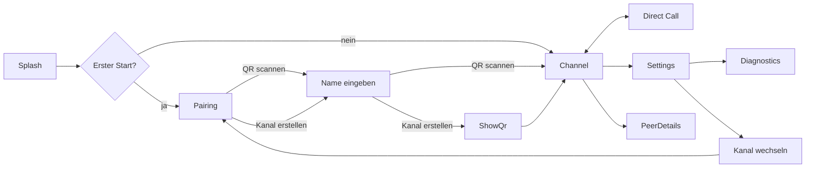

# HeraTalk — UI-Konzept und Mockups

> Frühes Mockup zur Diskussion. Wireframes als ASCII-Skizzen, Flows als Mermaid. Ziel: UX-Richtung festzurren, bevor Compose-Code entsteht.

## 1. Design-Prinzipien

1. **PTT als physisch-fühlbarer Anker.** Der PTT-Button ist in jedem Screen mit Audio-Kontext (Hauptscreen, Direktruf) **immer gleich groß und an derselben vertikalen Position** (unteres Drittel, zentriert). Nutzer können sprechen, ohne hinzusehen — Muscle Memory entwickelt sich innerhalb weniger Tage. Bestätigt durch haptisches Feedback beim Drücken und Loslassen.
2. **Ampel-Farblogik.** Farben sind funktional, nicht dekorativ:
   - **Grün** = aktiv, sprechend, verfügbar, alles gut.
   - **Blau** = Direktruf, privater Kontext.
   - **Gelb** = Warnung, Aufmerksamkeit gefordert, degradierter Zustand.
   - **Rot** = Fehler, Auflegen, kritische Aktion.
   - Neutrale UI-Elemente bleiben Grautöne; Farbe wird sparsam und bewusst eingesetzt.
3. **Netzwerk-Indikator immer präsent.** Oben rechts in jedem Screen, inklusive Direktruf. Zentrale Vertrauens-Information für Einsatz draußen, in der Werkstatt oder in Krisensituationen. Niemals ausblenden, niemals verstecken.
4. **Ein-Daumen-Bedienung.** Primär-Aktion im unteren Drittel. Destruktive Aktionen (Auflegen, Kanal verlassen) optisch separiert und mit Rot markiert, um versehentliche Fehlbedienung zu vermeiden.
5. **Klar, groß, ablenkungsfrei.** Funkgerät-Ersatz, nicht Smartphone-Spielzeug. Nutzer arbeiten neben der App, nicht in der App.
6. **Zustand sofort ablesbar.** "Wer spricht? Bin ich verbunden? Ist das Netz okay?" — jede dieser Fragen muss in ≤ 1 Sekunde Blickzeit beantwortbar sein.
7. **Fehler ehrlich kommunizieren.** Kein "Uups, etwas ist schiefgelaufen". Stattdessen: "Peer X ist aktuell nicht erreichbar (AP blockiert). Versuche Relay…"
8. **Dark-First.** Default-Theme. Hell-Theme ab v1.0 wählbar (F-14). Dark schont OLED-Akku und blendet nicht bei Nacht oder draußen.
9. **Barrierefrei.** Touch-Targets mindestens 48×48 dp, PTT-Button deutlich größer (ca. 110 dp Durchmesser — auch mit Arbeitshandschuhen erreichbar). WCAG-AA-Kontrast. TalkBack-kompatibel. Farbe nie alleiniger Informationsträger.
10. **Material-3-Expressive, zurückhaltend.** Dynamic Color (Android 12+) respektiert für Light-Theme, aber Ampel-Farben sind feste Signalfarben — sie werden nicht vom System-Wallpaper verfärbt.

## 2. Screen-Map



## 3. Screen 1 — Erststart: Kanal wählen

Erste Entscheidung: Beitreten oder selbst erstellen?

```
┌─────────────────────────────────────┐
│                                     │
│                                     │
│           ╭───────────╮             │
│           │  HeraTalk │             │
│           ╰───────────╯             │
│         LAN Walkie-Talkie           │
│                                     │
│                                     │
│                                     │
│   ┌───────────────────────────┐     │
│   │  📷  QR-Code scannen      │     │
│   │      einem Kanal beitreten│     │
│   └───────────────────────────┘     │
│                                     │
│   ┌───────────────────────────┐     │
│   │  ✨  Neuen Kanal erstellen│     │
│   │      und QR-Code anzeigen │     │
│   └───────────────────────────┘     │
│                                     │
│                                     │
│                                     │
└─────────────────────────────────────┘
```

**Zwei primäre Calls-to-Action.** Keine Fake-Wahl, keine Third-Party-Login-Illusion. Unten fix platziert für Einhand-Bedienung.

## 4. Screen 2 — Name eingeben

Direkt nach der Wahl "Kanal beitreten" oder "Neuen Kanal erstellen" — vor QR-Scan bzw. QR-Anzeige. Beim Erststart **leer**; beim Re-Pairing (Kanal wechseln über Settings) wird der zuletzt gespeicherte Name vorbelegt, der Screen wird in jedem Fall angezeigt und niemals übersprungen.

```
┌─────────────────────────────────────┐
│  ←                                  │
│                                     │
│   Wie heißt du?                     │
│                                     │
│   Dieser Name wird anderen Peers    │
│   im Kanal angezeigt.               │
│                                     │
│                                     │
│   ┌───────────────────────────┐     │
│   │  z. B. Anna oder Werks…   │ 0/32│
│   └───────────────────────────┘     │
│                                     │
│                                     │
│                                     │
│                                     │
│                                     │
│                                     │
│   ┌───────────────────────────┐     │
│   │  Weiter        (deaktiv.) │     │
│   └───────────────────────────┘     │
│                                     │
│   Du kannst den Namen später in     │
│   den Einstellungen ändern.         │
│                                     │
└─────────────────────────────────────┘
```

**Verhalten:**
- **Vorbelegung beim Erststart:** keine — Eingabefeld ist leer. Stattdessen Placeholder-Text (z. B. "z. B. Anna oder Werkstatt-Tablet"), der bei Eingabe verschwindet. **Kein** `Build.MODEL`, **kein** Geräte-Hostname.
- **Vorbelegung beim Re-Pairing:** der zuletzt in DataStore gespeicherte Name; voll editierbar.
- Zeichenzähler `X/32` rechts neben dem Textfeld, aktualisiert sich live (gemessen in Unicode-Codepoints).
- "Weiter" ist deaktiviert, bis ≥ 1 sichtbares Zeichen eingegeben wurde (rein aus Whitespace bestehende Eingaben gelten als leer).
- "Weiter" führt — abhängig vom vorherigen Schritt — zum QR-Scanner (Kanal beitreten) oder zum QR-Anzeige-Screen (Kanal erstellen).
- "Zurück"-Pfeil im Header führt zu Screen 1 (Kanal-Wahl). Bereits eingegebener Wert bleibt erhalten (DataStore).
- Name wird sofort in DataStore persistiert (`:core:identity`, Key `display_name`), damit er auch bei App-Neustart und nach dem Pairing abrufbar ist.
- Beim Re-Pairing: Der Screen wird stets angezeigt — auch wenn bereits ein Name existiert. Damit hat der Nutzer immer die Möglichkeit, vor dem Beitritt zu einem neuen Kanal seinen Namen zu prüfen oder zu ändern.

## 5. Screen 3 — QR-Code anzeigen (Kanal erstellt)

```
┌─────────────────────────────────────┐
│  ←         Kanal erstellt        ⋮  │
│─────────────────────────────────────│
│                                     │
│   "Werkstatt Nord" wurde erstellt.  │
│                                     │
│   Lass andere diesen QR-Code        │
│   scannen, um dem Kanal            │
│   beizutreten:                      │
│                                     │
│         ┌───────────────┐           │
│         │  ▓▓▓▓▓▓▓▓▓▓▓  │           │
│         │  ▓▓  ▓▓  ▓▓▓  │           │
│         │  ▓▓▓▓  ▓▓  ▓  │           │
│         │  ▓▓  ▓▓▓▓▓▓▓  │           │
│         │  ▓▓▓▓▓▓▓▓▓▓▓  │           │
│         └───────────────┘           │
│                                     │
│   ⏱  Gültig noch: 4 min 32 s       │
│                                     │
│   ⚠  Nur in Person zeigen —        │
│      nicht als Screenshot teilen.   │
│                                     │
│   ┌───────────────────────────┐     │
│   │  Fertig                   │     │
│   └───────────────────────────┘     │
└─────────────────────────────────────┘
```

**Security-UX:**
- Ablaufzeit prominent (trainiert Nutzer, QR-Codes nicht aufzubewahren).
- Warn-Hinweis direkt am QR-Code.
- `FLAG_SECURE` verhindert Screenshots (System-UI zeigt "Screenshots nicht erlaubt").

## 6. Screen 4 — Hauptscreen (Kanal aktiv)

Der Arbeits-Screen. Hier verbringt der Nutzer 99 % der Zeit.

```
┌─────────────────────────────────────┐
│  Werkstatt Nord              🟢  ⚙  │
│  Kanal · 3 Peers          Netz ok   │
│─────────────────────────────────────│
│                                     │
│   AKTIV                             │
│   ─────                             │
│   ┌───────────────────────────┐     │
│   │  Anna                     │     │
│   │  spricht · ▓▓▓▓▓▓▓░░░     │◀─── grüner Akzent
│   └───────────────────────────┘     │
│                                     │
│   ONLINE                            │
│   ──────                            │
│   ┌───────────────────────────┐     │
│   │  Bernd                    │     │
│   │  via Relay · 18 ms        │◀─── gelber Akzent (Warn)
│   └───────────────────────────┘     │
│                                     │
│   ┌───────────────────────────┐     │
│   │  Carla                    │     │
│   │  direkt · 6 ms            │     │
│   └───────────────────────────┘     │
│                                     │
│                                     │
│         ┌───────────────┐           │
│         │               │           │
│         │      🎙       │◀───────── PTT-Anker, fixe
│         │               │           Position (unteres
│         │  Halten zum   │           Drittel, zentriert),
│         │   Sprechen    │           ca. 110 dp Durchmesser
│         │               │           Rand grün (bereit)
│         └───────────────┘           │
│                                     │
└─────────────────────────────────────┘
```

**Aufbau und Regeln:**

- **Header:** Kanal-Name und Peer-Anzahl links. Netz-Indikator oben rechts mit Farbe und Kurz-Label. Zahnrad öffnet Settings. Der Netz-Indikator ist **immer** sichtbar, in jedem Screen mit Audio-Kontext.
- **Peer-Liste zweigeteilt:**
  - **Aktiv** (oben) — Peers, die gerade sprechen oder in einem Direktruf sind. Grün für Sprecher, blau für Peers im Direktruf.
  - **Online** (unten) — alle anderen verbundenen Peers.
  - Peers wechseln nahtlos zwischen den Gruppen; Animation: 200 ms Fade-Reorder.
  - Bei ≤ 1 Peer in "Aktiv" keine Gruppen-Überschrift anzeigen, Liste bleibt einfach.
- **Peer-Karte zweizeilig:**
  - Zeile 1: Name (groß, 16 sp, fett).
  - Zeile 2: Zustand + Transport-Info (klein, 12 sp, sekundär). Zustand-Beispiele: "spricht", "via Relay", "direkt · 6 ms", "schwacher Empfang", "im Direktruf mit Carla".
  - Bei sprechenden Peers: zusätzlich Live-RMS-Bar unter Zeile 2.
  - **Tap-kurz** auf Peer → Direktruf-Dialog mit Vorschau-Infos ("Anna direkt anrufen?").
  - **Tap-lang** (500 ms) auf Peer → Peer-Diagnose (Fingerprint, RTT-Verlauf, Keys).
- **Peer-Liste bei vielen Peers:** Scrollbar ab > 8 Peers. Die "Aktiv"-Gruppe sticky oben, damit Sprechende auch beim Scrollen sichtbar bleiben.
- **PTT-Button — fixer Anker:** Immer an derselben vertikalen Position (unteres Drittel, horizontal zentriert), immer gleich groß (ca. 110 dp Durchmesser). Auch im Direktruf-Screen. Nutzer greift blind zum unteren Drittel, der Button ist garantiert dort.
- **PTT-Zustände optisch:**
  - **Idle, Floor frei:** grüner Rand, heller Innenraum, Label "Halten zum Sprechen". Haptic-Feedback "tick" beim Berühren als Empfangs-Bestätigung.
  - **TX anfordern (Floor-Request läuft):** grüner pulsierender Rand.
  - **TX aktiv:** vollflächig grün gefüllt mit Glow, Label "LIVE · 00:04", Haptic-Impuls bei Start und Ende.
  - **Floor belegt (anderer spricht):** gelber Rand, ausgegraut, Label "Anna spricht". Tippen gibt kurzes Fehler-Haptik.
  - **Reconnecting:** gelber Rand mit Spinner, Label "Netz prüfen". Tippen sperrt.
  - **Fehler/Kein RECORD_AUDIO:** roter Rand, Label "Mikrofon erlauben", Tap öffnet Permission-Prompt.

**Wenn du selbst sprichst:**

```
┌─────────────────────────────────────┐
│  Werkstatt Nord              🟢  ⚙  │
│  Sendung läuft           3 Empfänger│
│─────────────────────────────────────│
│                                     │
│          Du sprichst                │
│                                     │
│           00:04                     │
│                                     │
│         ▓▓▓▓▓▓▓▓▓▓▓░░░              │◀─── Live RMS
│           -18 dB                    │
│                                     │
│                                     │
│                                     │
│         ┌───────────────┐           │
│         │               │           │
│         │      🎙       │◀───────── Gleiche Position,
│         │     LIVE      │           gleiche Größe,
│         │               │           jetzt vollflächig
│         │    00:04      │           grün gefüllt
│         │               │           │
│         └───────────────┘           │
│                                     │
└─────────────────────────────────────┘
```

PTT-Button bleibt **an derselben Stelle**. Peer-Liste tritt in den Hintergrund und wird durch Sende-Statistik ersetzt — aber der Button verschiebt sich nicht. Das ist die Muscle-Memory-Garantie.

## 7. Screen 5 — Direktruf

### 7.1 Eingehender Ruf

```
┌─────────────────────────────────────┐
│                                     │
│          Eingehender Ruf            │
│                                     │
│                                     │
│         ┌───────────────┐           │
│         │               │           │
│         │      AB       │           │
│         │               │           │
│         └───────────────┘           │
│              Anna B.                │
│                                     │
│     Werkstatt Nord · Direkt         │
│                                     │
│                                     │
│                                     │
│                                     │
│                                     │
│                                     │
│   ┌──────────┐     ┌──────────┐     │
│   │    ✕     │     │    ✓     │     │
│   │Ablehnen  │     │Annehmen  │     │
│   └──────────┘     └──────────┘     │
│                                     │
└─────────────────────────────────────┘
```

- Klingelt (mit respektvoller Lautstärke, nicht aufdringlich). Blauer Akzent signalisiert "Direktruf-Kontext".
- Zwei große Buttons, weit auseinander (versehentliches Annehmen vermeiden). Annehmen grün, Ablehnen rot.
- Haptisch-kontinuierliche Vibration beim Ringing.

### 7.2 Aktiver Direktruf

```
┌─────────────────────────────────────┐
│  ←  Direktruf                🟢  ⚙  │◀─── Netz-Indikator
│     mit Anna B.       Netz ok       │    bleibt sichtbar
│─────────────────────────────────────│
│                                     │
│         ┌───────────────┐           │
│         │      AB       │           │◀─── blauer Gradient
│         └───────────────┘           │    (Direktruf-Kontext)
│             Anna B.                 │
│                                     │
│            00:42                    │
│                                     │
│  🔇  Kanal stummgeschaltet          │◀─── gelb getönter
│      2 hören mit · Max spricht      │    Hinweis-Bereich
│      gerade                         │
│                                     │
│                                     │
│         ┌───────────────┐           │
│         │               │           │
│         │      🎙       │◀───────── Fixe Position,
│         │               │           gleiche Größe,
│         │  Halten zum   │           jetzt mit blauem
│         │   Sprechen    │           Rand statt grün
│         │               │           (Direktruf-Farbcode)
│         └───────────────┘           │
│                                     │
│   ┌───────────────────────────┐     │
│   │         Auflegen          │◀─── rot gefärbt
│   └───────────────────────────┘     │
└─────────────────────────────────────┘
```

- **PTT-Button-Position identisch zum Broadcast-Screen.** Gleiche Stelle, gleiche Größe. Nur der Ring-Farbton wechselt auf Blau, um den Kontext "privater Kanal" zu signalisieren.
- **Netz-Indikator oben rechts bleibt präsent.** Auch im Direktruf muss der Nutzer den Netzzustand sehen können.
- **Broadcast-Mute-Hinweis:** gelb getönt (Warn-Farbe), zeigt transparent, was der Nutzer gerade verpasst — inklusive Name des aktuell sprechenden Peers im Kanal, damit klar ist, ob ein Rückwechsel sinnvoll wäre.
- **Auflegen-Button rot** als klar destruktive Aktion, unterhalb der PTT-Linie — nicht an der gleichen Stelle, damit keine Verwechslungsgefahr besteht.

### 7.3 Eingehender Direktruf **während eigener Sendung**

Sonderfall (F-12). Der Nutzer drückt gerade PTT und sendet an den Broadcast-Kanal, oder ist bereits in einem anderen Direktruf. Full-Screen-Ringing wäre hier fatal — Nutzer verliert den Sende-Fokus und vielleicht die Floor.

Stattdessen: kompakte Heads-up-Einblendung am oberen Rand, non-intrusive:

```
┌─────────────────────────────────────┐
│ ┌─────────────────────────────────┐ │◀─── Heads-up,
│ │ 📞 Anna B. ruft direkt an       │ │    blauer Rand
│ │ [Später]          [Ablehnen]    │ │    (Direktruf)
│ └─────────────────────────────────┘ │
│─────────────────────────────────────│
│                                     │
│          Du sprichst                │
│            00:04                    │
│         ▓▓▓▓▓▓▓▓▓▓░░░               │
│                                     │
│                                     │
│                                     │
│         ┌───────────────┐           │
│         │      🎙       │           │
│         │     LIVE      │           │◀─── PTT-Button und
│         │    00:04      │           │    Sende-Indikator
│         └───────────────┘           │    bleiben unverändert
│                                     │    — der Nutzer kann
└─────────────────────────────────────┘    weiterreden
```

**Verhalten:**
- Heads-up-Signal konfigurierbar: Stumm / Vibration / Klingelton (Settings). Default: Vibration.
- Zwei Aktionen:
  - **"Später"** — Ruf bleibt als persistente Benachrichtigung stehen. Sobald der Nutzer seine Sendung beendet, öffnet sich der gewohnte Annehmen-Screen (7.1), vorausgesetzt Anna hält noch.
  - **"Ablehnen"** — Anna bekommt "Besetzt / später versuchen".
- Legt Anna von selbst auf, wird die Einblendung durch "Verpasster Ruf von Anna B." ersetzt und nach 5 Sekunden automatisch ausgeblendet.
- Der PTT-Zustand bleibt unverändert, die laufende Sendung läuft störungsfrei weiter.

## 8. Screen 6 — Settings

```
┌─────────────────────────────────────┐
│  ←         Einstellungen            │
│─────────────────────────────────────│
│                                     │
│   Audio                             │
│   ─────────                         │
│   Sprechmodus              PTT  >   │
│   Audio-Ausgabe   Lautsprecher  >   │
│                                     │
│                                     │
│   App-Verhalten                     │
│   ─────────                         │
│   Sprache            System folgen >│◀─── F-15: System ·
│                                     │    Deutsch · Englisch
│   Theme              System folgen >│◀─── v1.0 (F-14),
│                                     │    im MVP fix: Dark
│   Letzten Kanal bei                 │
│   App-Start fortsetzen         ○    │
│      Statt Kanal-Auswahl-Screen     │
│      direkt in den letzten Kanal.   │
│                                     │
│   Update-Prüfung bei Start     ○    │
│      Einmal pro Start mit GitHub    │
│      abgleichen, ob Sicherheits-    │
│      updates verfügbar sind.        │
│                                     │
│                                     │
│   Netzwerk                          │
│   ─────────                         │
│   🟢 Verbindung ist gut             │
│   ┌───────────────────────────┐     │
│   │  Netzwerk neu prüfen      │     │◀─── Button-Style,
│   └───────────────────────────┘     │    damit klar als
│   Diagnose anzeigen            >    │    Aktion erkennbar
│                                     │
│                                     │
│   Benachrichtigungen                │
│   ─────────                         │
│   Direktruf eingehend  Klingelton > │
│      Stumm · Vibration · Klingelton │
│                                     │
│   Direktruf während                 │
│   eigener Sendung     Vibration >   │
│      Sanftes Signal während du      │
│      selbst sendest oder in einem   │
│      Direktruf bist.                │
│                                     │
│                                     │
│   Features und Berechtigungen       │
│   ─────────                         │
│   🎙 VOX-Modus                 ●    │
│      Mikrofon bleibt dauerhaft      │
│      aktiv. Höherer Akkuverbrauch.  │
│                                     │
│      Schwellwert     −45 dB         │
│      [────────●─────────────]       │◀─── Live-RMS-Pegel
│      ▓▓▓▓▓▓▓▓▓▓░░░░░░░░░░░░░        │    direkt darunter
│                                     │
│   🎧 Hardware-PTT              ●    │
│      Zusätzliche PTT-Auslöser:      │
│      ☑ Bluetooth-Media-Button       │
│      ☐ Lautstärke hoch              │
│      ☐ Lautstärke runter            │
│      ⚠ Blockiert System-Lautstärke  │
│                                     │
│   🔔 Sidetone                  ○    │
│      Eigene Stimme beim Senden      │
│      leise mithören.                │
│                                     │
│   🔔 Wake-on-Direktruf         ●    │
│      Bildschirm bei eingehendem     │
│      Ruf einschalten.               │
│                                     │
│                                     │
│   Kanal                             │
│   ─────────                         │
│   Aktiver Kanal    Werkstatt Nord > │
│   Dein Name        Pascal S.     >  │
│   Kanal wechseln                >   │
│                                     │
│                                     │
│   Info                              │
│   ─────────                         │
│   Version              0.3.0 >      │
│   Open-Source-Lizenzen       >      │
│   Logs exportieren           >      │
│                                     │
└─────────────────────────────────────┘
```

**Gruppen-Reihenfolge (von häufigster Anpassung absteigend, mit logischer Lese-Progression):**

1. **Audio** — Grund-Verhalten der Sprach-Pipeline (Modus, Output-Routing). Nicht permission-relevant.
2. **App-Verhalten** — Gesamt-App-Zustand (Theme, Auto-Resume, Update-Prüfung).
3. **Netzwerk** — Live-Status und Diagnose-Werkzeuge. Hier landet der Nutzer, wenn etwas knirscht.
4. **Benachrichtigungen** — Direktruf-Signal-Verhalten in beiden Situationen (Idle und während eigener Sendung).
5. **Features und Berechtigungen** — alles, was Permissions oder Hintergrund-Verhalten ändert. Bewusst untergeordnet, weil hier sensible Toggles liegen.
6. **Kanal** — Kanal-spezifische Daten und Wechsel.
7. **Info** — Version, Lizenzen, Diagnose-Export.

Die Reihenfolge folgt einem **Lese-Pfad**: oben das Verhalten, das man laufend justiert, in der Mitte die Knöpfe für "wenn-was-nicht-stimmt", unten die "einmal-eingestellt"-Sektionen.

### 8.1 Live-Feedback bei Audio-Einstellungen

**VOX-Schwellwert-Slider** zeigt unmittelbar darunter den aktuellen RMS-Pegel des Mikrofons als gefüllte Bar. Der Nutzer spricht ins Gerät und sieht:

- Den aktuellen Pegel (Bar füllt sich).
- Die Schwellwert-Markierung (vertikaler Strich im Bar).
- Alles rechts vom Schwellwert ist grün gefärbt ("würde Sendung triggern"), alles links grau ("wird ignoriert").

So kann der Nutzer den Schwellwert passend zur eigenen Sprechlautstärke und Umgebungsgeräusch einstellen, ohne raten zu müssen. Im PTT-Modus ist der Slider ausgegraut (kein Einfluss, keine Aufnahme läuft).

### 8.2 Features und Berechtigungen — Verhalten

Jeder Toggle in dieser Gruppe bindet genau ein Feature an genau eine (oder mehrere) Permission. Das Aktivieren durchläuft immer denselben Ablauf:

1. Nutzer tippt auf den Toggle.
2. App prüft, ob alle nötigen Permissions vorhanden sind.
3. Fehlt eine, wird der System-Permission-Dialog angezeigt.
4. Bei Zustimmung aktiviert sich das Feature, der Toggle steht auf "an", und der Foreground-Service-Typ wird bei Bedarf auf `microphone` gewechselt.
5. Bei Ablehnung bleibt der Toggle auf "aus", und ein nicht-penetranter Hinweis erklärt die Folgen ("VOX deaktiviert — Mikrofon-Zugriff wurde verweigert. Du kannst das in den App-Einstellungen ändern.") mit einem Deep-Link zu den System-App-Einstellungen.

Auf Permission-Ablehnung wird **nicht** erneut gefragt. Der Nutzer muss aktiv die App-Einstellungen öffnen, die Permission zulassen und den Toggle danach erneut antippen.

**Hardware-PTT-Untermenü:** Nach Aktivierung des Haupt-Toggles erscheinen die Unter-Optionen (Bluetooth-Media-Button, Lautstärke hoch, Lautstärke runter) als einzeln aktivierbare Checkboxes. Beim ersten Einschalten einer Lautstärke-Option erscheint ein Bestätigungs-Dialog: "Solange HeraTalk läuft, steuern die Lautstärke-Tasten nicht mehr die System-Lautstärke. Fortfahren?" Nach Bestätigung persistiert die Wahl, keine weiteren Rückfragen.

### 8.3 Erstnutzer-Flow — was beim ersten Start passiert

Der allererste App-Start zeigt einen schlanken Willkommens-Dialog mit **genau einer sicherheitsrelevanten Entscheidung**:

```
┌─────────────────────────────────────┐
│                                     │
│   Willkommen bei HeraTalk           │
│                                     │
│   HeraTalk läuft vollständig offline│
│   im WLAN — keine Server, keine     │
│   Accounts, keine Telemetrie.       │
│                                     │
│   Eine Ausnahme möchten wir dir     │
│   zur Entscheidung vorlegen:        │
│                                     │
│   Soll HeraTalk beim Start kurz     │
│   mit GitHub prüfen, ob Sicher-     │
│   heitsupdates verfügbar sind?      │
│                                     │
│   ┌───────────────────────────┐     │
│   │  Nein — komplett offline  │     │
│   └───────────────────────────┘     │
│                                     │
│   ┌───────────────────────────┐     │
│   │  Ja — auf Updates prüfen  │     │
│   └───────────────────────────┘     │
│                                     │
│   (Entscheidung jederzeit in        │
│    Settings änderbar.)              │
│                                     │
└─────────────────────────────────────┘
```

Nach dieser Entscheidung:

- Keine weiteren Permission-Dialoge außer `POST_NOTIFICATIONS` (falls Android 13+) direkt vor dem ersten Service-Start.
- Als nächstes erscheint **§4 — Name eingeben**: Der Nutzer gibt seinen Display-Namen in ein leeres Pflichtfeld ein (Placeholder-Text, keine Vorbelegung, max. 32 Codepoints). "Weiter" ist deaktiviert, bis ≥ 1 sichtbares Zeichen eingegeben wurde. Erst danach wählt er "Kanal beitreten" oder "Neuen Kanal erstellen".
- Beim Tap auf "Kanal beitreten": `CAMERA` für den QR-Scan; Ablehnung führt zu einer Fallback-UI "Geheimen Code manuell eingeben".
- Beim Tap auf den PTT-Button zum ersten Mal: `RECORD_AUDIO`. Ablehnung deaktiviert PTT; der Nutzer kann weiterhin im Kanal *zuhören*.
- VOX, Hardware-PTT und Wake-on-Direktruf sind standardmäßig **aus**. Die Permissions werden erst beim Toggle angefragt.

Diese Abstufung stellt sicher, dass der Nutzer nur das sieht, was er gerade braucht, und nicht beim ersten Start mit fünf Permission-Dialogen überrollt wird. Die eine Initial-Frage zum Update-Check ist bewusst prominent — sie trifft eine Aussage über das Sicherheits-Modell und verdient ein bewusstes Ja/Nein.

## 9. Screen 7 — Diagnose

Für den Techniker-Nutzer. Nicht das Hauptpublikum, aber entscheidend für Troubleshooting.

```
┌─────────────────────────────────────┐
│  ←         Diagnose                 │
│─────────────────────────────────────│
│                                     │
│   Netzwerk                          │
│   ─────────                         │
│   SSID             Werkstatt-WLAN   │
│   IP                    192.168.4.7 │
│   mDNS funktioniert            ✓    │
│   Broadcast loopback           ✓    │
│   Multicast-Lock               ✓    │
│                                     │
│                                     │
│   Peers                             │
│   ─────────                         │
│                                     │
│   Anna (a7f3:2c91)                  │
│   ├ Transport        UDP direkt     │
│   ├ RTT              4 ms           │
│   ├ Loss             0.2 %          │
│   ├ Jitter           1 ms           │
│   ├ Bitrate          24 kbps        │
│   └ Keys             SRTP gen 1     │
│                                     │
│   Bernd (c2d4:8871)                 │
│   ├ Transport        Via Relay Anna │
│   ├ RTT              18 ms          │
│   ├ Loss             1.1 %          │
│   ├ Jitter           4 ms           │
│   ├ Bitrate          20 kbps        │
│   └ Keys             SRTP gen 1     │
│                                     │
│                                     │
│   Letzte Events                     │
│   ─────────                         │
│   12:34:01  Peer Bernd → Relay      │
│   12:33:55  Reconnect zu Anna ok    │
│   12:33:48  Peer Carla gefunden     │
│                                     │
│   ┌───────────────────────────┐     │
│   │  Logs in Datei exportieren│     │
│   └───────────────────────────┘     │
└─────────────────────────────────────┘
```

Log-Export ist **lokal** (Share-Sheet), kein automatischer Upload. Nutzer entscheidet, wohin.

## 10. Interaktionsmuster

### PTT-Button — fixer Anker und Zustände

**Positions-Invariante:** In allen Screens mit Audio-Kontext (Hauptscreen Kanal, Direktruf, VOX-aktiv) ist der PTT-Button an **derselben absoluten Position** und **derselben Größe** (110 dp Durchmesser). Das gilt auch, wenn der Screen ansonsten komplett anders aussieht (z. B. Sende-Fokus-Layout). Das ist die Muscle-Memory-Garantie.

| Zustand | Rand-Farbe | Füllung | Label | Haptisch | Verhalten bei Tap |
|---------|------------|---------|-------|----------|---------------------|
| Idle, Floor frei (Broadcast) | Grün | transparent | "Halten zum Sprechen" | Tick beim Anfassen | TX starten |
| Idle, Floor frei (Direktruf) | **Blau** | transparent | "Halten zum Sprechen" | Tick beim Anfassen | TX starten |
| TX Floor-Request läuft | Grün pulsierend | leichter Glow | "Warte auf Freigabe…" | kurzer Tick | weiterhalten |
| TX aktiv (Broadcast) | Grün | Grün gefüllt + Glow | "LIVE · 00:04" | Impuls bei Start und Ende | loslassen beendet |
| TX aktiv (Direktruf) | Blau | Blau gefüllt + Glow | "LIVE · 00:04" | Impuls bei Start und Ende | loslassen beendet |
| Floor belegt (anderer spricht) | Gelb | ausgegraut | "Anna spricht" | Fehler-Haptik bei Tap | Tap wird geschluckt |
| Reconnecting | Gelb mit Spinner | ausgegraut | "Netz prüfen" | — | Tap wird geschluckt |
| Kein RECORD_AUDIO | Rot | ausgegraut | "Mikrofon erlauben" | — | öffnet Permission-Prompt |

**VOX-Modus:** PTT-Button bleibt an derselben Position, Label wechselt auf "VOX aktiv", Rand pulsiert grün bei Sprach-Erkennung. Tippen deaktiviert VOX temporär auf Halten (falls der Nutzer Stille erzwingen will).

### Haptisches Feedback

- **PTT-Berührung:** kurzer Tick (MotionFeedback `GESTURE_START`). Bestätigt, dass der Button registriert hat.
- **PTT-Release:** Tick am Ende (`GESTURE_END`).
- **TX-Start (Floor granted):** kräftiger Impuls (`CONFIRM`). Nutzer weiß: ab jetzt sendest du.
- **TX-Ende (Floor released):** leichter Impuls (`CONFIRM`).
- **Floor verweigert:** doppelter Impuls (`REJECT`).
- **Eingehender Direktruf:** Klingel-Pattern (repetitiv, an Systemlautstärke gekoppelt).
- **Eingehender Direktruf während Sendung:** je nach Einstellung Vibration (Default) / Klingelton / stumm.

### Hardware-PTT-Auslöser (konfigurierbar, siehe F-13)

Mehrere Hardware-Quellen können parallel als PTT-Trigger dienen:

- **Bluetooth-Media-Button:** Play/Pause-Taste am BT-Headset. Via `MediaSession` + `MediaButtonReceiver`. Kein Konflikt mit anderen Apps, solange HeraTalk die aktive Media-Session hält.
- **Lautstärke-Tasten:** Volume-Up und/oder Volume-Down, einzeln aktivierbar. Beim Aktivieren erscheint Bestätigungs-Dialog zum Lautstärke-Konflikt. Abgefangen via `Activity.onKeyDown/Up` im Vordergrund und via dedizierten Receiver bei aktivem `microphone`-Service.
- **USB/BT-Fernbedienung:** post-v1.0, frei konfigurierbarer KeyCode.

Alle Hardware-Trigger sind default-aus. Aktivierung über Settings > Features > Hardware-PTT.

## 11. Farb-System

Farben sind funktional nach Ampel-Logik. Die einzige Ausnahme ist das Brand-Icon, das eine eigene Akzent-Farbe trägt.

| Rolle | Farbe (Dark Theme) | Farbe (Light Theme, v1.0) | Einsatz |
|-------|--------------------|-----------------------------|---------|
| **Active / Go / Verfügbar** | `#16a34a` (Material green 600) | `#15803d` | PTT-Rand idle Broadcast, PTT aktiv Broadcast, sprechender Peer, Netz-ok |
| **Direktruf / Privat** | `#2563eb` (blue 600) | `#1d4ed8` | Direktruf-Avatar, PTT-Rand im Direktruf, "im Direktruf"-Peer-Status |
| **Warning / Degradiert** | `#ca8a04` (amber 600) | `#a16207` | Floor belegt, Relay-Pfad, Broadcast-Mute-Hinweis, QR-Ablauf |
| **Error / Destruktiv** | `#dc2626` (red 600) | `#b91c1c` | Auflegen-Button, Permission fehlt, Verbindung verloren |
| **Brand / Logo-Akzent** | Gradient Teal → Blue | dito | nur im Splash/Onboarding — das Brand-Mark |

**Neutral-Skala:** Grautöne von fast-weiß (`#f5f5f4`) über warme Mittelstufen bis zu tiefem Anthrazit (`#0a0a0b`). Alle Texte und Hintergründe nutzen diese Skala; Farbe ist reserviert für Status-Signale.

Kontrast-Validierung: alle Kombinationen wurden gegen WCAG AA geprüft, Normal-Text 4.5:1, Large 3:1.

## 12. Typografie

- **Display und Body:** Manrope (400–800). Charakterprägend, warm, lesbar. Kein Inter, kein Roboto — die sind omnipräsent.
- **Monospace (Diagnose-Werte, Codes, Fingerprints):** JetBrains Mono. Vertraut in der Entwickler-Welt, aber sauber ausdruckend auch für Endnutzer.
- **Fallback:** System-Default, falls Manrope nicht verfügbar.

Schriftgrößen: kleinster Text 11 sp (Diagnose-Labels), Fließtext 13–14 sp, Peer-Name 16 sp, Headlines 22 sp, Timer 40 sp.

## 13. Internationalisierung im UI

Alle Nutzer-sichtbaren Texte stammen aus String-Ressourcen, niemals hartkodiert. MVP-Sprachen: **Englisch** (Default) und **Deutsch** (Override). Details zur Umsetzung in `docs/architecture.md §11.7`, Anforderung in `docs/requirements.md F-15`.

**Auswahl in Settings:**

Unter "App-Verhalten" → "Sprache" stehen drei Optionen:
- **System folgen** (Default) — übernimmt die System-Locale, fällt auf Englisch zurück, wenn kein passender Override existiert.
- **Deutsch**
- **Englisch**

Wechsel wirkt sofort, kein App-Neustart. Implementiert via `AppCompatDelegate.setApplicationLocales()`.

**Texte mit dynamischen Werten:**

Niemals String-Konkatenation (`"$name spricht"`), sondern Format-Strings mit positionalen Argumenten:

| Schlecht | Korrekt |
|----------|---------|
| `Text("$peerName spricht")` | `Text(stringResource(R.string.channel_peer_speaking, peerName))` |
| `"$count Peers"` | `pluralStringResource(R.plurals.channel_peer_count, count, count)` |
| `"Verbunden seit $duration"` | `stringResource(R.string.diagnostics_connected_since, duration)` |

**Locale-Spezifika in der UI:**

- **Deutsche Texte sind oft 30 % länger als englische.** Buttons, Tabs, Listen-Einträge müssen mit der längeren Variante harmonieren — wenn nicht, wird gekürzt oder das Layout flexibel.
- **Datums- und Zeitformate** folgen der Locale (Java `DateTimeFormatter`). "9:41 AM" → "09:41".
- **Zahlenformate** — Tausendertrennzeichen je nach Locale. Im MVP nicht kritisch, weil HeraTalk keine großen Zahlen anzeigt.
- **RTL-Sprachen** wie Arabisch sind im MVP nicht vorgesehen, aber die App wird mit `android:supportsRtl="true"` deklariert, damit eine Ergänzung später nicht in Layout-Fixes ausartet.

**Was bleibt unübersetzt:**

- **App-Name** "HeraTalk" — Markenname, identisch in allen Sprachen.
- **Fachbegriffe** wie "Peer", "Broadcast", "PTT", "VOX", "Floor", "Sidetone", "Relay" — bewusst kein deutsches Pseudo-Wort, weil die Begriffe in der Zielgruppe (Werkstatt, Outdoor-Teams, Tech-Affine) etabliert sind. Der Documenter pflegt das Glossar in `.claude/agents/documenter.md`.
- **Diagnose-Werte** wie "RTT", "Loss", "Jitter", "kbps" — internationale Einheiten und Akronyme.

## 14. Accessibility-Checkliste

- [ ] Alle Icon-only-Buttons haben `contentDescription` (lokalisiert).
- [ ] Touch-Targets mindestens 48×48 dp. PTT-Button 110 dp.
- [ ] Farbkontraste erfüllen WCAG AA (4.5:1 für Normal-Text, 3:1 für Large).
- [ ] Status-Informationen nicht ausschließlich durch Farbe kommuniziert (zusätzlich Text, Icon oder Position).
- [ ] Unterstützung für TalkBack, inklusive Live-Region-Announcements bei eingehendem Direktruf und Floor-Wechsel.
- [ ] Reduzierte Bewegung respektiert (`reduceMotion` → RMS-Bar statisch, Peer-Reorder ohne Animation).
- [ ] Schrift skaliert mit System-Font-Size (kein `sp`-Lockdown).
- [ ] Permission-Hinweise mit Deep-Link zu System-Einstellungen, kein Sackgassen-Dialog.
- [ ] Layout funktioniert mit der jeweils längeren Übersetzung (deutsche Tests gegen Layout-Overflow).

## 15. UX-Entscheidungen (Stand 2026-04-27)

Die in früheren Versionen offenen Fragen wurden entschieden:

1. **Sidetone bei TX:** Option in Settings-Gruppe "Features und Berechtigungen", Default **off**. Begründung: Sidetone ändert das Audio-Routing und gehört damit zu den Verhaltens-modifizierenden Features, nicht zu den Grund-Audio-Einstellungen. Entschieden.
2. **Peer-Avatare mit Initialen:** Ja, Nice-to-have für v1.0 (siehe `docs/releases.md` v1.0.0 Scope). Entschieden.
3. **Kanal-spezifische Farbe:** Ja, Nice-to-have für v1.0 oder später. Im MVP noch nicht relevant, da kein Multi-Channel. Entschieden.
4. **Letzten Kanal bei App-Start fortsetzen:** Default **off**, Option in Settings-Gruppe "App-Verhalten". Bewusst **kein** Auto-Start beim Geräte-Boot — HeraTalk läuft nur, wenn der Nutzer die App aktiv aufruft. `RECEIVE_BOOT_COMPLETED` wird **nicht** im Manifest deklariert. Wenn der Nutzer den Toggle aktiviert, überspringt die App lediglich den Kanal-Auswahl-Screen beim manuellen Start und springt direkt in den letzten genutzten Kanal. Entschieden.
5. **Wake-Screen bei Direktruf:** Ja, als Opt-in-Toggle "Wake-on-Direktruf" in Settings-Gruppe "Features und Berechtigungen" (gebunden an `USE_FULL_SCREEN_INTENT`). Default **an**, weil charakterprägend für Walkie-Talkie-Ersatz. Erwartete Einschränkung: Android 14+ gewährt die Permission restriktiv ("nur Telefonie-ähnliche Apps"), was wir im Manifest als zur App-Kategorie passend deklarieren und per `android:showWhenLocked` und `android:turnScreenOn` in der IncomingCallActivity unterstützen. Falls eine Android-Version oder ein Hersteller die Permission entzieht, degradiert das Feature auf eine Standard-Heads-Up-Notification — ohne Fehlermeldung, ohne Workaround-Versuche. Akzeptiert.
6. **i18n von Anfang an:** Englisch und Deutsch ab v0.1.0. Sprachauswahl in Settings ("System folgen" als Default). Übersetzungs-Pflege durch Documenter-Agent. Entschieden.

## 16. Nächste Schritte

- Ab v0.1.0 Screen-Skeletons in Compose umsetzen (nur Navigation, leere Screens), bereits mit String-Resources statt hartkodiert.
- Ab v0.2.0 Peer-Liste mit echten Daten.
- Design-System in `core:ui` extrahieren, sobald 3+ Composables wiederverwendet werden.
- Kein Design-Tool-Mockup (Figma o. ä.) für MVP — die ASCII-Wireframes plus HTML-Mockup (`docs/mockup.html`) reichen zur Diskussion, die Verfeinerung passiert direkt in Compose mit Previews.
